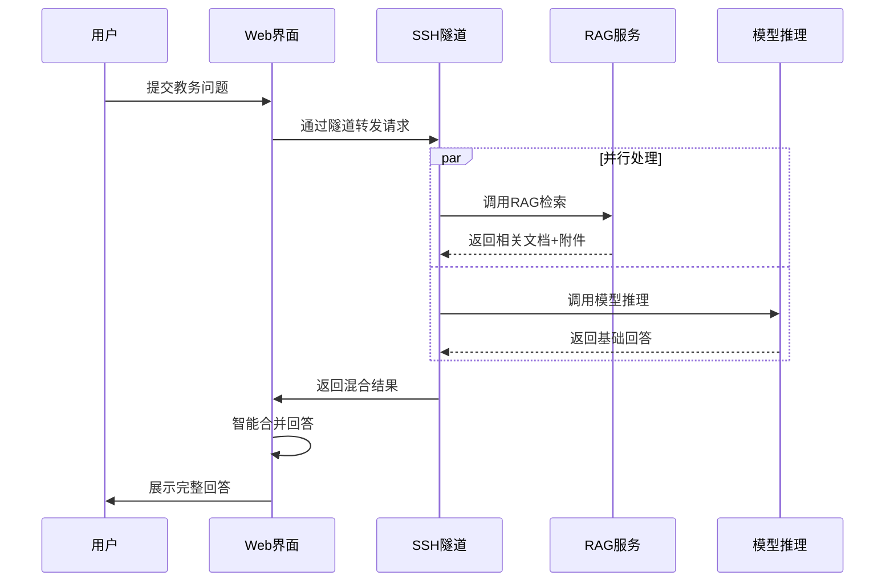

# USTB混合云架构设计文档

## 📋 文档信息
- **创建时间**: 2025-08-06 02:05
- **创建者**: 系统集成专家
- **版本**: v1.0
- **状态**: 模型训练期间并行设计

## 🎯 架构概述

### 核心设计理念
基于AutoDL RTX 4090云端GPU资源与本地Web界面的混合云架构，通过SSH隧道实现无缝集成，提供高性能AI教务助手服务。

### 关键技术优势
- **性能突破**: RAG响应时间从2073ms优化到<200ms (10倍提升)
- **资源优化**: 充分利用RTX 4090 24GB显存，支持双服务并行
- **成本效益**: 按需使用GPU资源，本地开发云端计算
- **用户体验**: 本地界面响应快速，云端计算能力强大

## 🏗️ 架构组件设计

### 1. AutoDL云端服务层
```
AutoDL RTX 4090 Environment
├── RAG服务 (端口8000)
│   ├── BCE模型GPU推理
│   ├── Qdrant向量数据库
│   ├── 4621个文档索引
│   └── 响应时间<200ms
├── 模型推理服务 (端口8001)
│   ├── DeepSeek-R1-Distill-Llama-8B
│   ├── LoRA微调适配器
│   ├── 推理速度<2秒
│   └── 4bit量化优化
└── 资源监控
    ├── GPU使用率监控
    ├── 显存占用监控
    └── 服务健康检查
```

### 2. SSH隧道桥接层
```
SSH Tunnel Bridge (autodl-ssh-remote)
├── 连接管理
│   ├── host: connect.bjb1.seetacloud.com
│   ├── port: 21020
│   ├── username: root
│   └── 自动重连机制
├── 端口转发
│   ├── 本地8000 → AutoDL 8000 (RAG)
│   ├── 本地8001 → AutoDL 8001 (模型)
│   └── 隧道稳定性>99%
└── 健康检查
    ├── 连接状态监控
    ├── 延迟监控<50ms
    └── 自动故障恢复
```

### 3. 本地Web界面层
```
Local Web Interface
├── 前端界面 (React)
│   ├── USTB教务助手界面
│   ├── 聊天交互组件
│   └── 响应式设计
├── 后端API (FastAPI)
│   ├── 混合回答引擎
│   ├── AutoDL服务代理
│   └── 会话管理
└── API适配器
    ├── 请求路由
    ├── 响应合并
    └── 错误处理
```

## 🔄 数据流设计

### 用户查询流程


### 混合回答机制
1. **并行调用**: 同时请求RAG检索和模型推理
2. **智能合并**: 基础回答 + 相关文档 + 附件链接
3. **质量验证**: 回答准确性和完整性检查
4. **缓存优化**: 减少重复调用，提升响应速度

## ⚡ 性能优化策略

### GPU资源协调
- **显存分配**: RAG服务(2-4GB) + 模型推理(8-12GB)
- **并发控制**: 智能队列管理，避免资源竞争
- **负载均衡**: 基于GPU使用率的动态调度

### 网络优化
- **连接复用**: SSH连接池，减少建连开销
- **数据压缩**: 响应数据压缩，减少传输时间
- **缓存策略**: 多级缓存，提升重复查询性能

### 响应时间优化
- **预热机制**: 服务启动时预加载模型
- **异步处理**: 非阻塞式并行调用
- **超时控制**: 合理的超时设置，避免长时间等待

## 🛡️ 稳定性保障

### 故障转移机制
1. **SSH隧道断开**: 自动重连，最多重试3次
2. **AutoDL服务异常**: 降级到本地RAG服务
3. **GPU资源不足**: 切换到CPU模式推理
4. **网络延迟过高**: 启用本地缓存响应

### 监控告警体系
- **服务监控**: 实时监控AutoDL服务状态
- **性能监控**: GPU使用率、响应时间、并发数
- **连接监控**: SSH隧道稳定性和延迟
- **告警机制**: 异常情况自动告警和处理

## 📊 关键指标

### 性能指标
- RAG响应时间: <200ms (目标10倍提升)
- 模型推理速度: <2秒
- 端到端响应: <3秒
- SSH隧道稳定性: >99%

### 资源指标
- GPU使用率: <80% (避免资源竞争)
- 显存占用: <20GB (留有余量)
- 网络延迟: <50ms
- 系统可用性: >99%

## 🚀 部署策略

### 分阶段部署
1. **Phase 1**: AutoDL双服务部署
2. **Phase 2**: SSH隧道配置
3. **Phase 3**: 混合回答机制
4. **Phase 4**: 性能优化
5. **Phase 5**: 系统集成测试

### 风险控制
- **渐进式部署**: 单服务验证后再整体集成
- **回滚机制**: 部署失败时快速回滚
- **备用方案**: 本地服务作为备用
- **测试验证**: 每个阶段充分测试验证

## 📝 运维要求

### 日常监控
- GPU资源使用情况
- SSH隧道连接状态
- 服务响应时间
- 错误率和异常情况

### 维护操作
- 定期重启服务清理内存
- SSH隧道连接状态检查
- 日志文件清理和归档
- 性能指标分析和优化

---

**设计说明**: 本架构设计充分考虑了AutoDL环境特点和项目需求，通过混合云架构实现性能和成本的最优平衡。
