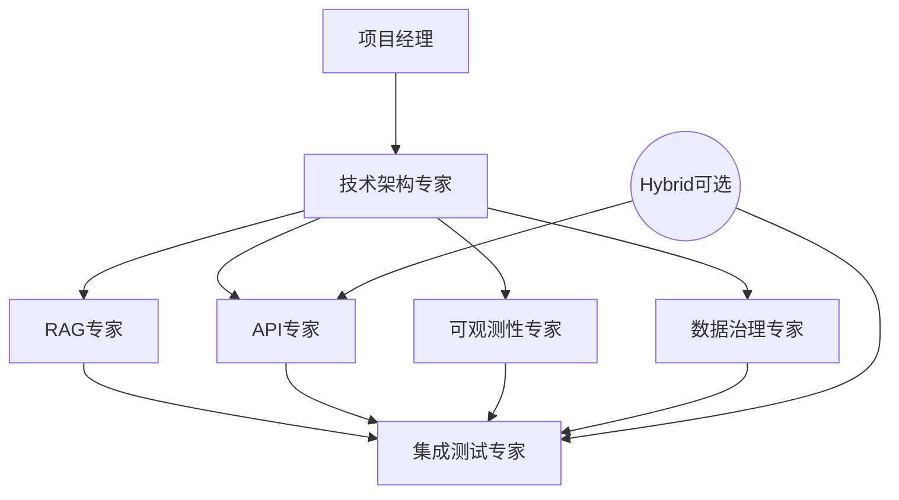
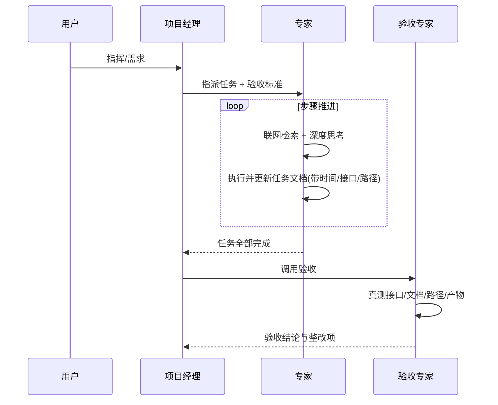
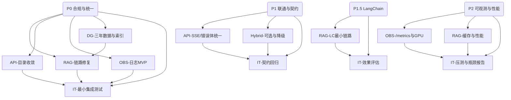

# USTB 项目统筹规划表 v2.0（重构版）

## 0. 目的与范围
以“分阶段执行→专家分工→严格验收”为核心，全面对齐《技术架构设计文档 v3.0》，将研发过程规范为可计划、可追踪、可验收、可回滚的闭环。

---

## 1. 总体原则（来自图片要求的统筹思想）
- 分阶段执行：
  - 第一阶段：核心功能为主（链路打通、可用为王）。
  - 第二阶段：性能与品质（可观测、稳定、体验）。
- 文档先行：每个阶段/每位专家独立“任务执行文档”，一步一更，带时间戳，接口与关键点必须写清。
- 联网与思考：出现问题必须“深度思考+联网搜索”后再行动（默认强制）。
- 日志与可观测：全程结构化日志与控制台输出、最终留存到日志目录；验收以日志和接口真实测试为准。

---

## 2. 角色体系与 PromptX 映射
- 用户（Owner）：提出需求与验收意见。
- 项目经理（Project Manager，@role://project-manager）：拆分任务、指派专家、维护里程碑、召回验收。
- 验收专家（Acceptance，@role://acceptance-expert）：按清单真测接口/文档/产物与路径，出具结论。
- 技术架构专家（@role://technical-architect）：把控技术路线、变更与风险。
- 领域专家（PromptX 角色）：
  - @role://rag-expert
  - @role://api-gateway-expert
  - @role://observability-expert
  - @role://data-governance-expert
  - @role://integration-test-expert
  - （可选）@role://hybrid-api-expert

> 统一约束：所有专家必须具备“深度思考 + 联网搜索 + 日志输出”能力；关键接口与产物路径必须在任务文档中明确。

---

## 3. 文档与产物结构（强约束）
- README 导航：docs/project/README.md
- 统筹规划（本文）：docs/project/USTB项目统筹规划表v2.0-重构版.md
- 技术文档：docs/technical/USTB项目技术架构设计文档v3.0.md
- 专家任务执行文档（v2.0 重构版）：
  - docs/project/experts/rag-expert.md
  - docs/project/experts/api-gateway-expert.md
  - docs/project/experts/observability-expert.md
  - docs/project/experts/data-governance-expert.md
  - docs/project/experts/integration-test-expert.md
  - docs/project/experts/hybrid-api-expert.md（可选）
- 验收清单：docs/project/验收清单.md
- 日志与报告：logs/**、tests/reports/**

---

## 4. 分阶段计划（As-Is → To-Be）
- 阶段 P0（1 周）：合规与统一（核心功能）
  - 统一配置/端口、去硬编码/去明文凭据、单一 MySQL 栈、RAG 先行链路、日志 MVP、API 收敛。
- 阶段 P1（1 周）：联通与契约
  - OpenAI 兼容层（流/非流/SSE）统一错误体；Hybrid 改为可选（默认直连 RAG）。
- 阶段 P1.5（1 周）：LangChain 最小接入
  - Retriever→Reranker→PromptTemplate→LLM 的最小链路与效果评估。
- 阶段 P2（1 周）：可观测与性能
  - /metrics 指标集、SLO/SLI 基准；缓存与降级；压测与瓶颈优化。

---

## 5. 专家依赖关系（mermaid）


---

## 6. 执行流程（mermaid）


---

## 7. 专家任务（阶段化+可验收）
（略，详见对应专家文档：docs/project/experts/*.md）

---

## 8. 验收清单（对应 5 条关键原则）
（详见：docs/project/验收清单.md）

---

## 9. 里程碑与评审
- M0（P0 完成）：最小联通通过（health/models/chat/search）。
- M1（P1 完成）：SSE/错误体统一，Hybrid 可选化。
- M2（P1.5 完成）：LangChain 最小链路 + 效果报告。
- M3（P2 完成）：SLO 达标（P95<3s、错误率<1%）、50 并发稳定。

---

## 10. 风险与回滚
- 隧道不稳/端口受限：默认直连 RAG，Hybrid 降级；可转本地 Qdrant 镜像。
- 显存紧张：INT8/分时加载；GPU 指标告警与熔断。
- 数据清洗导致召回下降：临时白名单补偿；快照回滚。
- 契约变更：旧路径 30 天迁移窗口。

---

## 10.1 AutoDL环境配置与部署（脱敏示例）

### 10.1.1 AutoDL环境信息
```bash
# SSH连接信息（使用占位符，生产请使用密钥/环境变量注入，禁止明文）
Host: <HOST>
Port: <PORT>
Username: <USER>
Password: <PASSWORD>  # 文档仅示例，不应明文

# 项目路径
Project Root: /root/autodl-tmp/ustb-project/

# Python环境
Python Path: /root/miniconda3/envs/unsloth/bin/python
Environment: unsloth (conda环境)
```

> 配置模板：请复制 `config/env.example` 为项目根目录 `.env`，并按环境填写变量值（严禁提交真实敏感信息）。

### 10.1.2 AutoDL服务端口配置（统一口径）
```bash
# 服务端口映射（统一）
- RAG服务：8000 (services/rag_system/)
- LoRA推理：8001 (services/model_inference/ustb_lora_inference_server.py)
- 混合API：8002 (services/model_inference/api_interface.py)
- Web API连接器：8003 (system/web_integration/web_api_connector.py)
- Qdrant：6333 (向量数据库)
- GPU监控：9100 (system/monitoring/)

# 说明：后端API网关在本地开发默认 8001；若与 LoRA 同机冲突，请改用 8005 或通过环境变量覆盖。
```

### 10.1.3 SSH隧道配置（脱敏示例）
```powershell
# 本地PowerShell隧道命令（推荐一次性映射四个服务）
ssh -p <PORT> -L 8000:localhost:8000 -L 8001:localhost:8001 -L 8002:localhost:8002 -L 8003:localhost:8003 <USER>@<HOST>

# 分别建立隧道（可选）
ssh -p <PORT> -L 8000:localhost:8000 <USER>@<HOST>  # RAG服务
ssh -p <PORT> -L 8001:localhost:8001 <USER>@<HOST>  # LoRA推理
ssh -p <PORT> -L 8002:localhost:8002 <USER>@<HOST>  # 混合API
ssh -p <PORT> -L 8003:localhost:8003 <USER>@<HOST>  # Web连接器
```

### 10.1.4 AutoDL环境验证命令
```bash
# 在AutoDL环境内验证
curl http://localhost:8000/health  # RAG服务健康检查
curl http://localhost:8001/health  # LoRA推理服务健康检查
curl http://localhost:8002/health  # 混合API健康检查
curl http://localhost:8003/health  # Web API连接器健康检查
nvidia-smi                         # GPU状态检查
```

### 10.1.5 AutoDL目录结构
```bash
/root/autodl-tmp/ustb-project/
├── src/backend/                   # API网关服务
├── services/rag_system/          # RAG服务
├── system/
│   ├── web_integration/          # 混合API服务
│   └── monitoring/               # GPU监控
├── data/                         # 数据文件
├── logs/                         # 日志文件
├── tests/                        # 测试文件
└── scripts/                      # 脚本文件
```

---

## 11. 模板（可复制使用）

### 11.1 专家任务执行文档模板
```markdown
# {expert} 任务执行文档
## 基本信息
- 专家：{expert}
- 阶段：P{0/1/1.5/2}
- 任务来源：统筹规划v2.0 第{章节}

## 步骤记录（每步都要写，带时间戳）
### 步骤N（YYYY-MM-DD HH:mm）
- 目标：
- 操作（含联网检索要点）：
- 产物路径：
- 接口/配置变更：
- 日志关键ID/截图：
- 风险与回滚：

## 阶段小结
- 完成项：
- 待办与风险：
```

### 11.2 验收清单模板
```markdown
# 阶段验收清单（P{0/1/1.5/2}）
- 用例列表：health/models/chat/search
- 覆盖指标：
  - 功能：通过/失败细项
  - 性能：P95、错误率、并发
  - 日志：覆盖率、5xx链路可复盘
  - 数据：近3年校验、时间过滤
- 结论与整改：
```

---

## 12. 导航
- 技术文档：docs/technical/USTB项目技术架构设计文档v3.0.md
- 本统筹（重构版）：docs/project/USTB项目统筹规划表v2.0-重构版.md
- 专家文档：docs/project/experts/*.md
- 验收清单：docs/project/验收清单.md
- API 映射：docs/project/api-map.md
- 日志规范：docs/project/log-spec.md
- 指标规范：docs/project/metrics.md

---

## 13. 统筹三要素（你要求的“更详细版”）

### 13.1 专家分工（逐项可验收）+ 依赖关系（更细）



- 任务粒度与交付（节选）：
  - RAG-链路修复（A1）
    - 子任务：检索→重排→生成→后处理；强制在回答末尾列出附件与URL；空召回给出改写建议。
    - 依赖：DG-三年数据（A4）。
    - 交付：
      - 代码：`src/backend/routes/chat.py`、`src/services/rag_system/retrieval_engine.py`
      - 用例：`tests/integration/rag_flow.test.ts`
      - 日志：`logs/rag_flow/*.log`
  - API-目录收敛（A2）
    - 子任务：仅保留 `GET /v1/models`、`POST /v1/chat/completions`、`POST /api/v1/search`、`GET /api/v1/categories`、`POST|GET /api/v1/feedback`、`GET /health`、`GET /metrics`；其余 404/410（30 天迁移）。
    - 交付：路由映射说明 `docs/project/api-map.md`；自动化用例 `tests/integration/api_contract.test.ts`。
  - OBS-日志MVP（A3）
    - 子任务：JSON 日志+`X-Request-ID`贯穿；关键阶段打点；日志脱敏。
    - 交付：日志规范 `docs/project/log-spec.md`；示例日志 `logs/samples/*.jsonl`。
  - DG-三年数据与索引（A4）
    - 子任务：过滤近3年、时间纠偏、索引重建（Qdrant 稳定 doc_id/哈希）。
    - 交付：清洗脚本 `scripts/data/clean_recent.py`；报告 `data/governance/reports/data_quality_report.md`。
  - IT-最小集成测试（A5）
    - 子任务：health/models/chat/search 最小集；报告产出。
    - 交付：`tests/integration/**`、`tests/reports/M0_baseline.json`。

（其它任务在“7. 专家任务”章节按阶段展开，以上为颗粒度示例，确保每个子任务都“有依赖、有产物路径、有验收”。）

### 13.2 文件夹结构 + 存放内容（可复制的落地约束）

```text
docs/
  project/
    README.md                      # 导航
    USTB项目统筹规划表v2.0-重构版.md
    api-map.md                     # API保留/弃用清单与映射
    log-spec.md                    # 日志结构化规范
    验收清单.md                      # 阶段/用例/标准
    rag-expert/任务执行文档.md
    api-gateway-expert/任务执行文档.md
    observability-expert/任务执行文档.md
    data-governance-expert/任务执行文档.md
    integration-test-expert/任务执行文档.md
  technical/
    USTB项目技术架构设计文档v3.0.md

scripts/
  data/clean_recent.py             # 近三年清洗与时间纠偏
  ops/export_metrics.sh            # 指标采集/对接Prometheus

tests/
  integration/                     # health/models/chat/search 合同测试
  performance/                     # 压测脚本（locust/k6）
  reports/                         # 阶段报告（M0/M1/M2/M3）

logs/
  rag_flow/                        # RAG链路关键事件日志
  samples/                         # 日志样例（验收用）

data/
  governance/reports/              # 数据质量/清洗报告
```

说明：以上结构为强约束，验收专家按此路径逐项检查。若路径/命名不符，直接判定“不合规”。

### 13.3 验收标准（含测试步骤/期望输出/文件位置）

| 阶段 | 用例 | 步骤（示例curl） | 期望输出 | 产物位置 |
|---|---|---|---|---|
| P0 | health | `curl http://localhost:8001/health` | 200；services字段反映RAG可用或degraded | logs/rag_flow/*.log |
| P0 | models | `curl http://localhost:8001/v1/models` | 有 `ustb-***` 模型ID列表 | tests/reports/M0_baseline.json |
| P0 | search | `curl -X POST /api/v1/search -d '{"query":"选课"}'` | total>0；结果publish_date均在近3年 | data/governance/reports/data_quality_report.md |
| P0 | chat（非流） | `curl -X POST /v1/chat/completions` | 文本尾部列出附件与URL；`rag_results` 非空 | logs/rag_flow/*.log |
| P1 | chat（SSE） | 前端SSE或`curl -N` | 分块返回，结尾`[DONE]`；错误体统一 | tests/integration/api_contract.test.ts |
| P1 | 旧API弃用 | 访问历史路径 | 404/410 + 迁移指引 | docs/project/api-map.md |
| P1.5 | LC效果 | 执行评测脚本 | 产出召回@k/NDCG/延迟对比 | tests/reports/M2_lc_eval.json |
| P2 | 指标/日志 | `curl /metrics`、检查JSON日志 | 有请求量/耗时/错误率/外部健康；日志可按request_id串 | logs/samples/*.jsonl |
| P2 | 压测 | locust/k6 | P95<3s、错误率<1%、50并发 | tests/reports/M3_perf.json |

判定规则：
- “功能/契约”以HTTP状态码与JSON字段为准；
- “数据”以近3年的时间校验为准；
- “日志/指标”以是否可复盘全链路与是否暴露核心指标为准；
- “性能”以报告中的P95/错误率/并发为准；
- 任何不一致必须在“任务执行文档”中给出整改与回滚记录。

