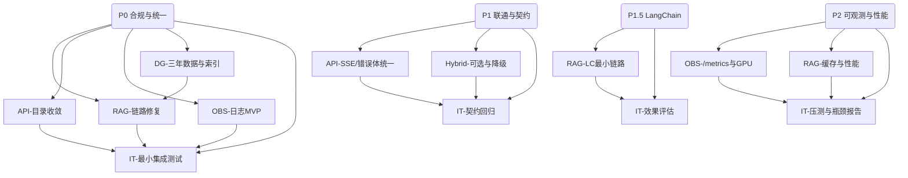
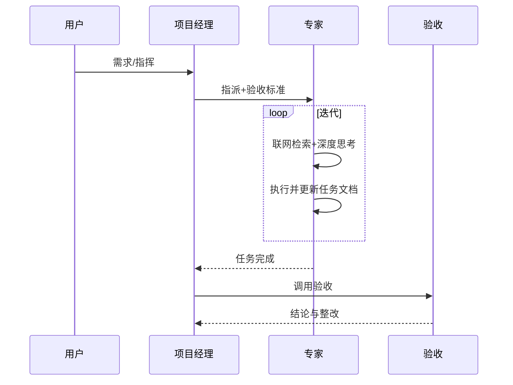

# USTB 项目统筹规划表 v2.1（重构精简版）

> 目的：以“统筹三要素”为中心重排结构：1) 专家分工+依赖（含交付与路径）；2) 文件结构+存放内容；3) 验收标准（含步骤/期望/产物）。其余信息（阶段计划、流程、里程碑、风险）并入附录。

---

## A. 统筹三要素（核心）

### A1. 专家分工 + 依赖（含交付与路径）



| 专家任务 | 子任务要点 | 交付物 | 产物路径 |
|---|---|---|---|
| RAG-链路修复 | 检索→重排→生成→后处理；回答尾部列出附件与URL；空召回提示改写 | 代码+用例+日志 | `src/backend/routes/chat.py`、`src/services/rag_system/retrieval_engine.py`、`tests/integration/rag_flow.test.ts`、`logs/rag_flow/*.log` |
| API-目录收敛 | 仅保留：`/v1/models`、`/v1/chat/completions`、`/api/v1/search`、`/api/v1/categories`、`/api/v1/feedback`、`/health`、`/metrics`；其余404/410（30天） | 路由映射+合同测试 | `docs/project/api-map.md`、`tests/integration/api_contract.test.ts` |
| OBS-日志MVP | JSON日志+`X-Request-ID`贯穿；检索/生成/降级打点；脱敏 | 日志规范+样例 | `docs/project/log-spec.md`、`logs/samples/*.jsonl` |
| DG-三年数据与索引 | 近3年过滤、时间纠偏、Qdrant稳定doc_id/哈希索引 | 清洗脚本+质量报告 | `scripts/data/clean_recent.py`、`data/governance/reports/data_quality_report.md` |
| IT-最小集成测试 | health/models/chat/search 最小集 | 测试套件+基线报告 | `tests/integration/**`、`tests/reports/M0_baseline.json` |
| API-SSE/错误体统一 | SSE标准块+`[DONE]`；统一错误结构 | 契约说明+回归用例 | `docs/project/api-map.md`、`tests/integration/api_contract.test.ts` |
| Hybrid 可选与降级 | 失败改走RAG；配置化HYBRID_API_URL | 配置说明+降级用例 | `.env.example`、`tests/integration/api_contract.test.ts` |
| LC最小链路 | Retriever→Reranker→Prompt→LLM；召回/NDCG/延迟对比 | 评测脚本+报告 | `tests/performance/lc_eval.*`、`tests/reports/M2_lc_eval.json` |
| /metrics与GPU | Prometheus指标集；NVIDIA GPU Exporter | 指标文档+Dashboard | `docs/project/metrics.md`、`system/monitoring/**` |
| 压测与瓶颈 | P95/错误率/并发；瓶颈点 | 压测脚本+报告 | `tests/performance/**`、`tests/reports/M3_perf.json` |

---

### A2. 文件结构 + 存放内容（强约束）

```text
docs/
  project/
    README.md
    USTB项目统筹规划表v2.1-重构精简版.md
    api-map.md
    log-spec.md
    验收清单.md
    rag-expert/任务执行文档.md
    api-gateway-expert/任务执行文档.md
    observability-expert/任务执行文档.md
    data-governance-expert/任务执行文档.md
    integration-test-expert/任务执行文档.md
  technical/USTB项目技术架构设计文档v3.0.md

scripts/data/clean_recent.py
tests/integration/**
tests/performance/**
tests/reports/**
logs/rag_flow/**
logs/samples/**
data/governance/reports/**
```

说明：验收按此目录逐项核验；不符合即“不合规”。

---

### A3. 验收标准（含步骤/期望/产物）

| 阶段 | 用例 | 步骤（示例） | 期望输出 | 产物位置 |
|---|---|---|---|---|
| P0 | /health | `curl :8001/health` | 200；services反映RAG可用/降级 | logs/rag_flow/*.log |
| P0 | /v1/models | `curl :8001/v1/models` | 含`ustb-*` | tests/reports/M0_baseline.json |
| P0 | /api/v1/search | POST `{"query":"选课"}` | total>0；均为近3年 | data/governance/reports/data_quality_report.md |
| P0 | /v1/chat/completions | 非流 | 文尾附件与URL；`rag_results`非空 | logs/rag_flow/*.log |
| P1 | /v1/chat/completions | SSE | 分块+`[DONE]`；错误体统一 | tests/integration/api_contract.test.ts |
| P1 | 旧API | 访问历史路径 | 404/410+迁移指引 | docs/project/api-map.md |
| P1.5 | LC评估 | 运行评测脚本 | 召回/NDCG/延迟对比 | tests/reports/M2_lc_eval.json |
| P2 | /metrics/日志 | `curl :8001/metrics` | 请求量/耗时/错误率/外部健康；按request_id可复盘 | logs/samples/*.jsonl |
| P2 | 压测 | locust/k6 | P95<3s、错误率<1%、50并发 | tests/reports/M3_perf.json |

判定：功能与契约看HTTP与JSON；数据看近3年；日志看可复盘；性能看P95/错误率/并发；任何缺陷必须在“任务执行文档”内记录整改与回滚。

---

## B. 附录（阶段/流程/里程碑/风险/模板）

### B1. 分阶段计划（摘要）
- P0：配置统一、去硬编码、单一DB、RAG先行、日志MVP、API收敛
- P1：SSE与错误体统一；Hybrid可选降级
- P1.5：LangChain最小链路
- P2：/metrics+GPU、缓存与降级、压测与优化

### B2. 执行流程（sequence）


### B3. 里程碑
- M0：P0 通过（最小联通）
- M1：P1 通过（SSE/错误体统一，Hybrid可选）
- M2：P1.5 通过（LC效果报告）
- M3：P2 通过（SLO达标）

### B4. 风险与回滚
- 隧道不稳/端口受限 → 默认直连RAG，Hybrid降级；或本地Qdrant镜像
- 显存紧张 → INT8/分时加载；GPU指标告警与熔断
- 数据清洗影响召回 → 临时白名单+快照回滚
- 契约变更 → 旧路径30天迁移窗口

### B5. 模板（可复制）

任务执行文档模板：见 `docs/project/USTB项目统筹规划表v2.0-重构版.md` 第11节（保持单一来源）。

---

## C. 导航
- 设计文档：`docs/technical/USTB项目技术架构设计文档v3.0.md`
- 统筹（重构精简版）：`docs/project/USTB项目统筹规划表v2.1-重构精简版.md`
- 统筹（重构详细版）：`docs/project/USTB项目统筹规划表v2.0-重构版.md`

> 配置模板：请复制 `config/env.example` 为项目根目录 `.env`，并按环境填写变量值（严禁提交真实敏感信息）。

---

## D. 统一口径（端口与脱敏示例）

- 端口（统一）：RAG=8000、LoRA=8001、Hybrid=8002、Web=8003、Qdrant=6333、GPU=9100
- SSH 示例（脱敏）：`ssh -p <PORT> -L 8000:localhost:8000 -L 8001:localhost:8001 -L 8002:localhost:8002 -L 8003:localhost:8003 <USER>@<HOST>`
- 敏感信息：公共文档禁止出现真实密码/Token，使用占位符并由环境变量/密管注入


