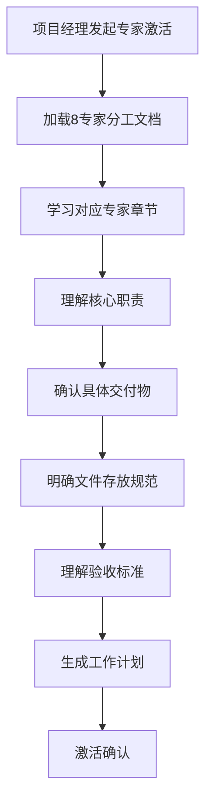
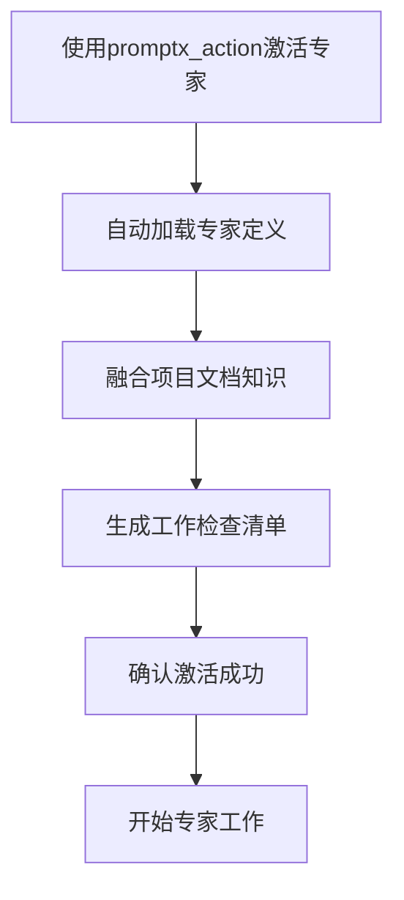
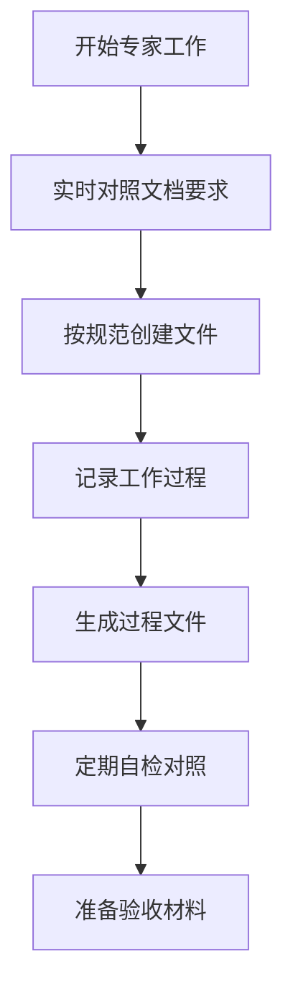
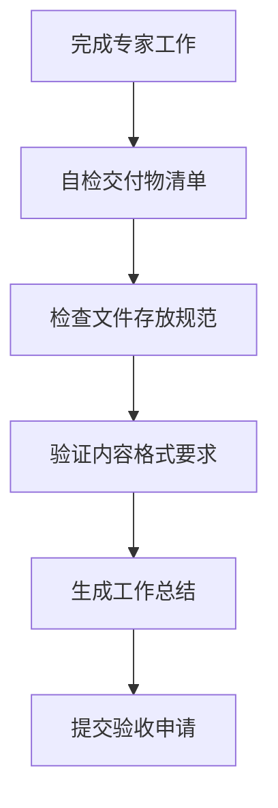

# USTB项目专家激活标准流程

## 🎯 流程目标
建立标准化的专家激活流程，确保每个专家在开始工作前完全理解项目要求、交付物标准和工作规范，杜绝执行偏差。

## 📋 标准激活流程

### 阶段一：激活前准备 (必须完成)


#### 1.1 文档学习要求
**必须学习的文档**：
- `docs/project/USTB项目8专家分工详细文档.md` - 对应专家章节
- `docs/project/文件夹结构说明.md` - 文件存放规范
- `docs/project/强制文档对照机制.md` - 质量要求

**学习深度要求**：
- 逐字阅读专家职责描述
- 完整理解所有交付物要求
- 明确文件格式和内容标准
- 理解验收检查点和时间节点

#### 1.2 交付物确认清单
基于8专家分工文档，每个专家必须确认：

**数据处理专家交付物**：
- [ ] RAG检索数据文件: `data/processed/rag_data.json`
- [ ] 微调训练数据文件: `data/processed/training_data.json`
- [ ] 数据质量报告: `reports/data_quality_report.md`
- [ ] 数据处理脚本: `scripts/data_processing/` (7个脚本文件)
- [ ] API调用日志: `logs/qwen_api_calls.log`

**数据科学专家交付物**：
- [ ] 独立验证报告: `reports/data_science_validation.md`
- [ ] 数据分析可视化: `analysis/data_visualization/` (4个图表)
- [ ] 质量监控仪表板: `dashboard/quality_monitor.html`
- [ ] 统计分析脚本: `scripts/data_analysis/` (3个脚本)

**问答生成专家交付物**：
- [ ] 问答对数据集: `data/processed/qa_dataset.json`
- [ ] 生成策略文档: `docs/technical/qa_generation_strategy.md`
- [ ] 质量评估报告: `reports/qa_quality_report.md`
- [ ] 生成脚本: `scripts/qa_generation/` (4个脚本)

**RAG系统专家交付物**：
- [ ] 向量数据库: `data/vectors/qdrant_db/`
- [ ] RAG API服务: `src/rag_system/` (完整API)
- [ ] 检索性能报告: `reports/rag_performance_report.md`
- [ ] 部署文档: `docs/deployment/rag_deployment.md`

**Web前端专家交付物**：
- [ ] 前端应用: `src/frontend/` (ChatGPT-Next-Web定制化应用)
- [ ] USTB定制化配置: `.env.local` (环境变量配置)
- [ ] OpenAI兼容API集成: 连接RAG系统
- [ ] 功能验证报告: 聊天功能和用户体验测试

**Web后端专家交付物**：
- [ ] 后端API: `src/backend/` (完整FastAPI)
- [ ] API文档: `docs/api/backend_api.md`
- [ ] 后端测试: `tests/backend/`
- [ ] 数据库配置: `src/backend/database/`

**模型训练专家交付物**：
- [ ] 微调模型: `models/finetuned/` (LoRA适配器)
- [ ] 训练脚本: `scripts/training/`
- [ ] 训练报告: `reports/training_report.md`
- [ ] 模型评估: `reports/model_evaluation.md`

**系统集成专家交付物**：
- [ ] 集成系统: `deployment/integrated_system/`
- [ ] 集成测试: `tests/integration/`
- [ ] 部署文档: `docs/deployment/system_deployment.md`
- [ ] 运维手册: `docs/operations/system_operations.md`

#### 1.3 文件存放规范确认
**必须明确的存放位置**：
- 源代码: `src/`
- 脚本文件: `scripts/`
- 数据文件: `data/`
- 报告文件: `reports/`
- 测试文件: `tests/`
- 临时文件: `temp/`
- 日志文件: `logs/`
- 文档文件: `docs/`

### 阶段二：激活执行 (标准化操作)


#### 2.1 激活命令标准
```bash
# 标准激活命令
promptx_action_promptx(role="专家ID")

# 激活后必须确认
- 专家角色正确加载
- 项目文档知识融合
- 工作计划生成完成
```

#### 2.2 激活后验证
**必须验证的内容**：
- [ ] 专家角色特征正确激活
- [ ] 项目特定知识正确加载
- [ ] 交付物清单完整确认
- [ ] 文件存放规范明确
- [ ] 验收标准理解正确

### 阶段三：工作过程管理 (持续监控)


#### 3.1 工作过程要求
**必须遵循的原则**：
- 所有工作严格按照8专家分工文档执行
- 文件创建必须遵循存放规范
- 工作过程必须产生真实的记录文件
- 定期自检对照文档要求

#### 3.2 过程文件要求
**必须产生的过程文件**：
- 工作日志记录
- API调用日志
- 错误处理记录
- 性能测试记录
- 质量检查记录

### 阶段四：验收准备 (提交前检查)


#### 4.1 自检清单
**提交前必须自检**：
- [ ] 所有交付物按清单完成
- [ ] 文件存放位置正确
- [ ] 文件命名规范符合要求
- [ ] 内容格式符合文档标准
- [ ] 过程文件完整记录

#### 4.2 提交标准
**验收申请必须包含**：
- 完整的交付物清单
- 自检结果确认
- 工作过程总结
- 发现的问题和解决方案

## 🔧 实施要求

### 对项目经理的要求
1. **严格执行流程**：每次专家激活必须按照标准流程执行
2. **深度文档学习**：确保专家完全理解项目要求
3. **过程监控**：定期检查专家工作是否按照文档执行
4. **标准化验收**：使用统一的验收检查清单

### 对专家的要求
1. **认真学习文档**：激活前必须深度学习项目文档
2. **严格按照要求**：所有工作必须严格按照文档执行
3. **实时记录过程**：工作过程必须产生真实的记录文件
4. **主动自检对照**：定期自检工作是否符合文档要求

## 📊 质量控制指标

### 激活质量指标
- 文档学习完成率：100%
- 交付物确认准确率：100%
- 激活后验证通过率：100%

### 工作质量指标
- 文档要求执行率：100%
- 文件存放规范符合率：100%
- 过程文件完整率：100%

### 验收质量指标
- 自检通过率：≥95%
- 验收一次通过率：≥90%
- 交付物完整率：100%

## ⚠️ 违规处理

### 激活阶段违规
- 文档学习不充分：重新学习，延迟激活
- 交付物确认错误：重新确认，更新工作计划

### 工作阶段违规
- 不按文档执行：立即纠正，重新对照文档
- 文件存放违规：立即整改，规范存放

### 验收阶段违规
- 自检不充分：重新自检，完善交付物
- 交付物不符合要求：重新制作，严格按照文档

---

**制定时间**: 2025-08-04  
**制定人**: 梁晓阳项目经理  
**适用范围**: USTB AI教务助手项目全体专家  
**执行状态**: 立即生效
