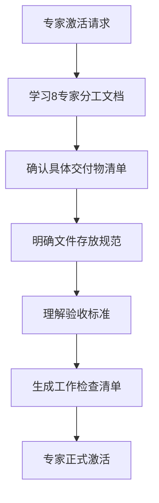
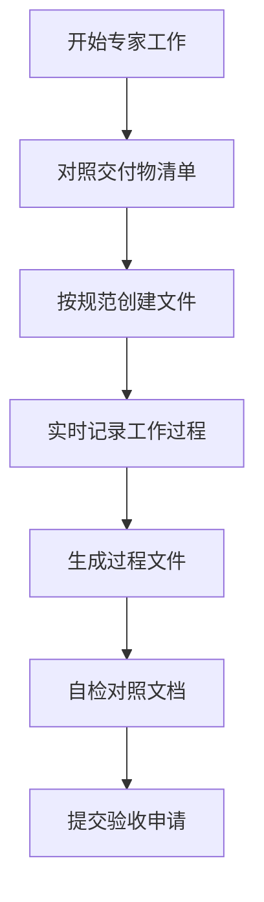
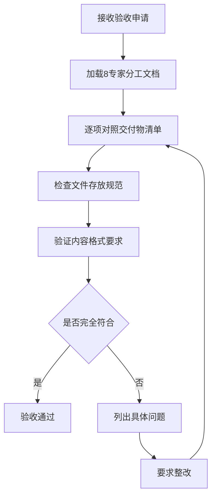

# USTB项目强制文档对照机制

## 🎯 机制目标
确保每个专家的工作严格按照《USTB项目8专家分工详细文档.md》执行，杜绝交付物遗漏、文件乱放、标准不一致等问题。

## 🚨 问题根因分析

### 发现的系统性问题
1. **角色定义与执行脱节**：专家激活后没有深度融合项目特定文档
2. **文件管理规范失效**：明确规定了存放位置但实际执行中乱放
3. **过程管理缺失**：把交付物当作"作业"而非工作过程的自然产物
4. **项目经理监督失效**：没有严格按照8专家分工文档逐项检查

### 根本原因
- **缺乏强制对照机制**：没有建立专家工作与文档要求的强制对照流程
- **验收标准模糊**：项目经理验收时没有详细的检查清单
- **文档学习不深入**：专家激活时没有深度学习项目特定要求

## 📋 强制文档对照机制设计

### 阶段一：专家激活前置检查

**强制要求**：
1. 必须学习对应专家的完整分工文档
2. 必须确认所有交付物的具体要求
3. 必须明确文件存放位置和命名规范
4. 必须理解验收标准和检查点

### 阶段二：工作过程强制对照

**强制要求**：
1. 每个交付物必须严格按照文档格式和内容要求
2. 文件必须存放在指定位置，使用规范命名
3. 工作过程必须产生真实的日志和记录文件
4. 提交前必须自检对照文档要求

### 阶段三：项目经理验收对照

**强制要求**：
1. 必须使用标准化验收检查清单
2. 每个交付物必须逐项对照文档检查
3. 发现问题必须具体指出文档要求和实际差异
4. 不符合要求的绝不通过验收

## 📝 专家工作检查清单模板

### 数据处理专家检查清单
基于《USTB项目8专家分工详细文档.md》第42-140行

#### 交付物对照检查
- [ ] **RAG检索数据文件**: `data/processed/rag_data.json`
  - [ ] 包含附件链接
  - [ ] JSON格式符合文档示例
  - [ ] 包含所有必需字段：id, title, content, url, category, publish_date, attachments, qwen_score, score_breakdown
  
- [ ] **微调训练数据文件**: `data/processed/training_data.json`
  - [ ] 纯文本，无附件
  - [ ] 筛选500条高质量数据
  - [ ] JSON格式符合文档示例
  
- [ ] **数据质量报告**: `reports/data_quality_report.md`
  - [ ] 筛选前后数据对比统计
  - [ ] 6维度评分分布图表
  - [ ] 重复率分析和去重日志
  - [ ] 质量问题识别和处理记录
  
- [ ] **数据处理脚本**: `scripts/data_processing/`
  - [ ] `qwen_scorer.py` - Qwen评分系统
  - [ ] `deduplication.py` - 去重处理脚本
  - [ ] `attachment_extractor.py` - 附件信息提取脚本
  - [ ] `data_splitter.py` - 双数据集分离脚本
  - [ ] `link_validator.py` - 附件链接验证脚本
  - [ ] `data_validator.py` - 数据验证脚本
  - [ ] `config.yaml` - 配置文件
  
- [ ] **API调用日志**: `logs/qwen_api_calls.log`
  - [ ] 每次API调用记录
  - [ ] 成本统计和额度使用情况

#### 文件存放规范检查
- [ ] 脚本文件在：`scripts/data_processing/`
- [ ] 处理后数据在：`data/processed/`
- [ ] 测试文件在：`tests/unit/data_processing/`
- [ ] 日志文件在：`logs/`

#### 验收检查点对照
- [ ] Day 2: Qwen API环境配置完成
- [ ] Day 3: 数据筛选算法开发完成
- [ ] Day 4: 高质量数据输出完成

### 其他专家检查清单
（待补充：数据科学专家、问答生成专家、RAG系统专家、Web前端专家、Web后端专家、模型训练专家、系统集成专家）

## 🔧 实施流程

### 1. 立即实施
- 为当前数据处理专家补充缺失的交付物
- 建立标准化的验收检查清单
- 制定文件管理强制检查机制

### 2. 后续专家激活
- 每个专家激活前必须完成文档学习
- 工作过程中实时对照检查
- 验收时严格按照清单逐项检查

### 3. 持续改进
- 根据实际执行情况优化检查清单
- 建立专家工作质量评估机制
- 定期回顾和改进对照机制

## 📊 成功指标

### 过程指标
- 专家激活前文档学习完成率：100%
- 交付物文档符合率：100%
- 文件存放规范执行率：100%

### 结果指标
- 验收一次通过率：≥90%
- 交付物遗漏率：0%
- 文件管理违规率：0%

## ⚠️ 强制执行要求

### 对专家的要求
1. **必须深度学习**：激活前必须完整学习对应的专家分工文档
2. **必须严格执行**：所有工作必须严格按照文档要求执行
3. **必须自检对照**：提交前必须自检对照文档要求

### 对项目经理的要求
1. **必须使用检查清单**：验收时必须使用标准化检查清单
2. **必须逐项对照**：每个交付物必须逐项对照文档检查
3. **必须零容忍**：不符合要求的绝不通过验收

### 违规处理
- **专家违规**：立即要求整改，重新学习文档要求
- **项目经理违规**：立即纠正验收标准，重新执行验收
- **系统性违规**：暂停项目，重新设计管理机制

---

**制定时间**: 2025-08-04  
**制定人**: 梁晓阳项目经理  
**适用范围**: USTB AI教务助手项目全体专家  
**执行状态**: 立即生效
