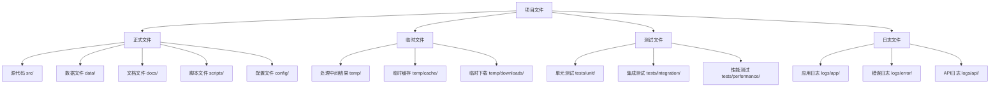
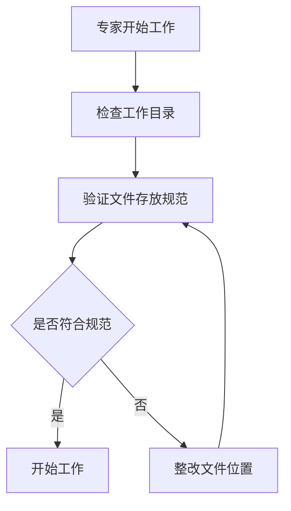
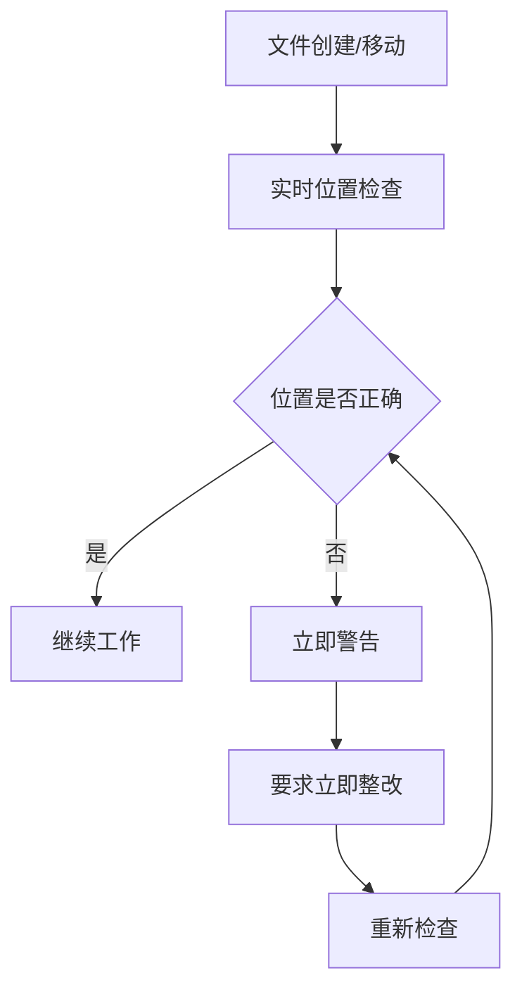
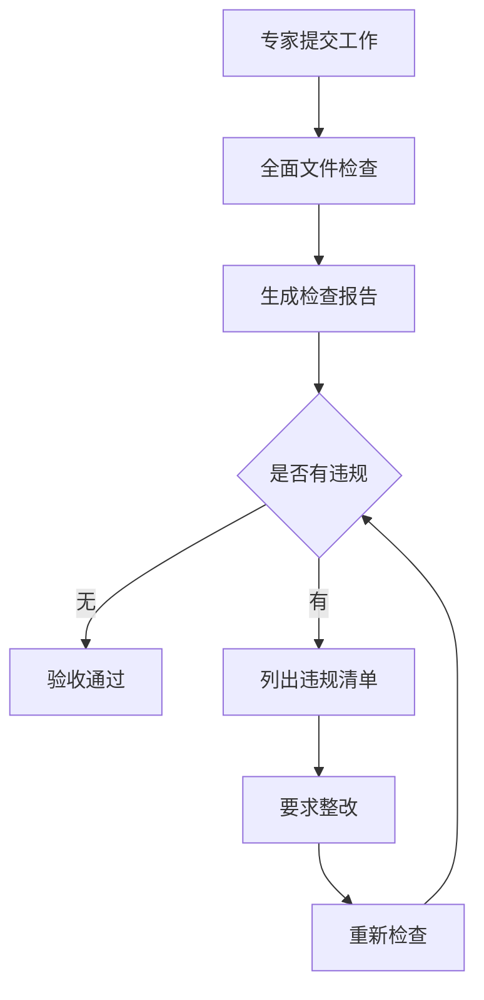

# USTB项目文件管理强制检查机制

## 🎯 机制目标
建立严格的文件管理检查机制，确保测试文件、临时文件、正式文件严格分离，杜绝文件乱放、混淆存储等问题，维护项目文件结构的清晰性和可维护性。

## 🚨 当前问题分析

### 发现的文件管理问题
1. **文件乱放**：明确规定了存放位置但实际执行中随意存放
2. **类型混淆**：测试文件、临时文件、正式文件混合存储
3. **命名不规范**：文件命名不遵循项目规范
4. **清理不及时**：临时文件长期占用存储空间
5. **权限混乱**：不同类型文件的访问权限管理混乱

### 根本原因
- **缺乏强制检查**：没有自动化的文件存放检查机制
- **规范执行不严**：文件存放规范没有强制执行
- **监控机制缺失**：没有实时监控文件存放情况
- **清理机制缺失**：没有定期清理临时文件的机制

## 📋 文件分类管理规范

### 文件分类定义


### 严格分离原则

#### 1. 正式文件 (永久保存)
**存放位置**：
- `src/` - 源代码文件
- `data/` - 数据文件
- `docs/` - 文档文件
- `scripts/` - 脚本文件
- `config/` - 配置文件
- `reports/` - 报告文件

**管理要求**：
- 必须版本控制
- 严格命名规范
- 完整文档说明
- 定期备份

#### 2. 临时文件 (定期清理)
**存放位置**：
- `temp/` - 所有临时文件根目录
- `temp/processing/` - 数据处理中间结果
- `temp/cache/` - 缓存文件
- `temp/downloads/` - 临时下载文件
- `temp/workspace/` - 临时工作空间

**管理要求**：
- 不纳入版本控制
- 自动定期清理
- 大小限制控制
- 访问权限限制

#### 3. 测试文件 (独立管理)
**存放位置**：
- `tests/unit/` - 单元测试
- `tests/integration/` - 集成测试
- `tests/performance/` - 性能测试
- `tests/data/` - 测试数据
- `tests/fixtures/` - 测试固件

**管理要求**：
- 独立版本控制
- 与正式代码分离
- 自动化执行
- 结果记录保存

#### 4. 日志文件 (轮转管理)
**存放位置**：
- `logs/app/` - 应用日志
- `logs/error/` - 错误日志
- `logs/api/` - API调用日志
- `logs/performance/` - 性能日志
- `logs/audit/` - 审计日志

**管理要求**：
- 自动轮转
- 压缩存储
- 定期归档
- 安全访问

## 🔧 强制检查机制设计

### 1. 实时文件监控系统
```python
# 文件监控检查器
import os
import json
from pathlib import Path
from datetime import datetime

class FileLocationChecker:
    def __init__(self, project_root):
        self.project_root = Path(project_root)
        self.rules = self.load_file_rules()
        self.violations = []
    
    def load_file_rules(self):
        """加载文件存放规则"""
        return {
            "正式文件": {
                "allowed_paths": ["src", "data", "docs", "scripts", "config", "reports"],
                "forbidden_patterns": ["test_", "temp_", "tmp_"],
                "required_extensions": [".py", ".md", ".json", ".yaml", ".sql"]
            },
            "临时文件": {
                "allowed_paths": ["temp"],
                "auto_cleanup": True,
                "max_age_days": 7,
                "max_size_mb": 1000
            },
            "测试文件": {
                "allowed_paths": ["tests"],
                "required_patterns": ["test_", "_test", "Test"],
                "forbidden_paths": ["src", "data", "scripts"]
            },
            "日志文件": {
                "allowed_paths": ["logs"],
                "auto_rotate": True,
                "max_size_mb": 100,
                "retention_days": 30
            }
        }
    
    def check_file_location(self, file_path):
        """检查文件位置是否符合规范"""
        rel_path = Path(file_path).relative_to(self.project_root)
        file_type = self.detect_file_type(rel_path)
        
        if not self.is_location_valid(rel_path, file_type):
            violation = {
                "file": str(rel_path),
                "type": file_type,
                "violation": "位置不符合规范",
                "expected_location": self.get_expected_location(file_type),
                "timestamp": datetime.now().isoformat()
            }
            self.violations.append(violation)
            return False
        return True
    
    def detect_file_type(self, file_path):
        """检测文件类型"""
        path_str = str(file_path).lower()
        
        if "test" in path_str or file_path.parts[0] == "tests":
            return "测试文件"
        elif file_path.parts[0] == "temp":
            return "临时文件"
        elif file_path.parts[0] == "logs":
            return "日志文件"
        else:
            return "正式文件"
    
    def scan_project(self):
        """扫描整个项目检查文件位置"""
        violations_found = []
        
        for root, dirs, files in os.walk(self.project_root):
            for file in files:
                file_path = Path(root) / file
                if not self.check_file_location(file_path):
                    violations_found.append(file_path)
        
        return violations_found
```

### 2. 自动化检查脚本
```python
# 自动检查脚本
class AutoFileChecker:
    def __init__(self, project_root):
        self.checker = FileLocationChecker(project_root)
        self.report_file = "temp/file_check_report.json"
    
    def run_daily_check(self):
        """每日自动检查"""
        violations = self.checker.scan_project()
        
        report = {
            "check_time": datetime.now().isoformat(),
            "total_violations": len(violations),
            "violations": self.checker.violations,
            "recommendations": self.generate_recommendations()
        }
        
        # 保存检查报告
        with open(self.report_file, 'w', encoding='utf-8') as f:
            json.dump(report, f, ensure_ascii=False, indent=2)
        
        # 如果有违规，发送警告
        if violations:
            self.send_violation_alert(report)
        
        return report
    
    def generate_recommendations(self):
        """生成整改建议"""
        recommendations = []
        
        for violation in self.checker.violations:
            rec = {
                "file": violation["file"],
                "action": f"移动到 {violation['expected_location']}",
                "command": f"move {violation['file']} {violation['expected_location']}"
            }
            recommendations.append(rec)
        
        return recommendations
    
    def auto_fix_violations(self, dry_run=True):
        """自动修复违规（可选择试运行）"""
        fixed_count = 0
        
        for violation in self.checker.violations:
            if violation["type"] == "临时文件":
                # 自动移动临时文件
                if not dry_run:
                    self.move_file_to_temp(violation["file"])
                fixed_count += 1
        
        return fixed_count
```

### 3. 实时监控预警系统
```python
# 实时监控系统
import watchdog
from watchdog.observers import Observer
from watchdog.events import FileSystemEventHandler

class FileLocationMonitor(FileSystemEventHandler):
    def __init__(self, checker):
        self.checker = checker
        self.violations_log = "logs/file_violations.log"
    
    def on_created(self, event):
        """文件创建时检查"""
        if not event.is_directory:
            if not self.checker.check_file_location(event.src_path):
                self.log_violation(event.src_path, "创建在错误位置")
                self.send_immediate_alert(event.src_path)
    
    def on_moved(self, event):
        """文件移动时检查"""
        if not event.is_directory:
            if not self.checker.check_file_location(event.dest_path):
                self.log_violation(event.dest_path, "移动到错误位置")
                self.send_immediate_alert(event.dest_path)
    
    def log_violation(self, file_path, violation_type):
        """记录违规日志"""
        log_entry = {
            "timestamp": datetime.now().isoformat(),
            "file": file_path,
            "violation": violation_type,
            "action_required": "立即整改"
        }
        
        with open(self.violations_log, 'a', encoding='utf-8') as f:
            f.write(json.dumps(log_entry, ensure_ascii=False) + '\n')
    
    def send_immediate_alert(self, file_path):
        """发送即时警告"""
        print(f"🚨 文件位置违规警告: {file_path}")
        print(f"请立即移动到正确位置！")
```

## 📊 检查执行流程

### 1. 专家工作前检查


### 2. 工作过程中监控


### 3. 工作完成后验收


## 🔧 自动化清理机制

### 1. 临时文件自动清理
```python
# 临时文件清理器
class TempFileCleaner:
    def __init__(self, temp_dir="temp"):
        self.temp_dir = Path(temp_dir)
        self.max_age_days = 7
        self.max_size_mb = 1000
    
    def clean_old_files(self):
        """清理过期临时文件"""
        cleaned_count = 0
        cleaned_size = 0
        
        for file_path in self.temp_dir.rglob("*"):
            if file_path.is_file():
                age_days = (datetime.now() - datetime.fromtimestamp(file_path.stat().st_mtime)).days
                
                if age_days > self.max_age_days:
                    file_size = file_path.stat().st_size
                    file_path.unlink()
                    cleaned_count += 1
                    cleaned_size += file_size
        
        return cleaned_count, cleaned_size
    
    def clean_large_files(self):
        """清理大文件"""
        total_size = sum(f.stat().st_size for f in self.temp_dir.rglob("*") if f.is_file())
        
        if total_size > self.max_size_mb * 1024 * 1024:
            # 按修改时间排序，删除最旧的文件
            files = [(f, f.stat().st_mtime) for f in self.temp_dir.rglob("*") if f.is_file()]
            files.sort(key=lambda x: x[1])
            
            for file_path, _ in files:
                if total_size <= self.max_size_mb * 1024 * 1024:
                    break
                
                file_size = file_path.stat().st_size
                file_path.unlink()
                total_size -= file_size
```

### 2. 日志文件轮转管理
```python
# 日志轮转管理器
class LogRotationManager:
    def __init__(self, logs_dir="logs"):
        self.logs_dir = Path(logs_dir)
        self.max_size_mb = 100
        self.retention_days = 30
    
    def rotate_logs(self):
        """轮转日志文件"""
        for log_file in self.logs_dir.rglob("*.log"):
            if log_file.stat().st_size > self.max_size_mb * 1024 * 1024:
                # 压缩并重命名
                timestamp = datetime.now().strftime("%Y%m%d_%H%M%S")
                archived_name = f"{log_file.stem}_{timestamp}.log.gz"
                
                # 压缩原文件
                self.compress_file(log_file, self.logs_dir / archived_name)
                
                # 创建新的空日志文件
                log_file.write_text("")
    
    def cleanup_old_logs(self):
        """清理过期日志"""
        for log_file in self.logs_dir.rglob("*.log.gz"):
            age_days = (datetime.now() - datetime.fromtimestamp(log_file.stat().st_mtime)).days
            
            if age_days > self.retention_days:
                log_file.unlink()
```

## 📋 检查清单和标准

### 专家工作检查清单
- [ ] 所有源代码文件在 `src/` 目录
- [ ] 所有数据文件在 `data/` 目录
- [ ] 所有脚本文件在 `scripts/` 目录
- [ ] 所有测试文件在 `tests/` 目录
- [ ] 所有临时文件在 `temp/` 目录
- [ ] 所有日志文件在 `logs/` 目录
- [ ] 文件命名符合项目规范
- [ ] 临时文件已标记清理时间

### 项目经理验收检查清单
- [ ] 运行自动文件位置检查
- [ ] 检查文件分类是否正确
- [ ] 验证临时文件清理机制
- [ ] 确认日志文件轮转正常
- [ ] 检查文件权限设置
- [ ] 验证备份机制有效

## ⚠️ 违规处理流程

### 即时违规处理
1. **发现违规** → 立即警告
2. **记录违规** → 写入违规日志
3. **要求整改** → 具体整改指导
4. **重新检查** → 确认整改完成

### 定期违规清理
1. **每日检查** → 生成违规报告
2. **自动修复** → 可自动修复的违规
3. **人工处理** → 需要人工判断的违规
4. **持续监控** → 防止违规再次发生

---

**制定时间**: 2025-08-04  
**制定人**: 梁晓阳项目经理  
**适用范围**: USTB AI教务助手项目全体专家  
**执行状态**: 立即生效
