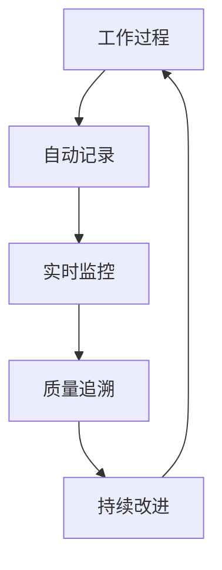
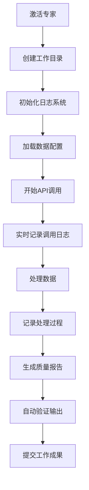
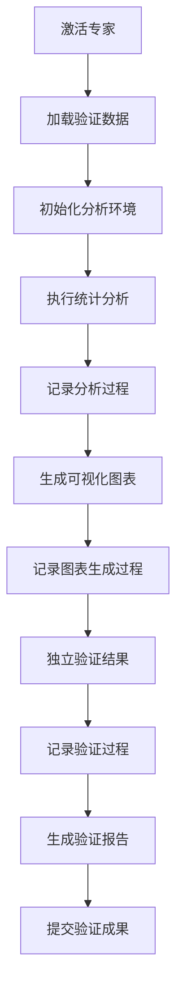
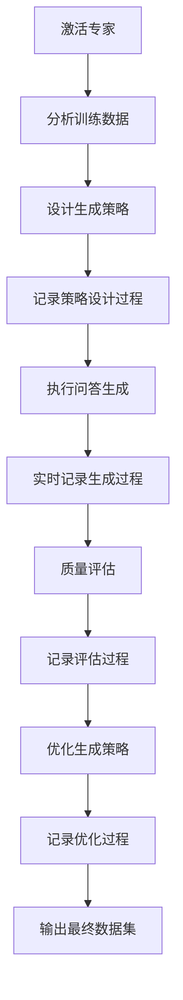

# USTB项目过程导向工作流程设计

## 🎯 设计目标
建立过程导向的工作流程，确保专家工作产生真实的过程文件和工作痕迹，而非事后补充的文档，实现工作过程的完整记录和质量追溯。

## 🚨 当前问题分析

### 发现的核心问题
1. **结果导向思维**：把交付物当作"作业"来完成，而非工作过程的自然产物
2. **事后补充文档**：API调用日志、测试记录等应该是过程中产生的，却变成了事后补充
3. **过程记录缺失**：缺少真实的工作过程记录，无法追溯问题和验证质量
4. **工作痕迹不完整**：专家工作没有留下完整的工作痕迹和决策记录

### 根本原因
- **流程设计缺陷**：没有设计过程文件自动生成机制
- **工具使用不当**：没有利用工具的日志记录功能
- **质量意识不足**：没有意识到过程记录的重要性
- **监控机制缺失**：没有实时监控工作过程的机制

## 📋 过程导向工作流程设计

### 核心设计原则


1. **过程即记录**：每个工作步骤都自动产生记录文件
2. **实时即监控**：工作过程实时监控，及时发现问题
3. **记录即证据**：过程记录作为质量验证的证据
4. **追溯即改进**：通过过程追溯持续改进工作质量

### 专家工作流程重设计

#### 数据处理专家工作流程


**过程文件自动生成**：
- `logs/qwen_api_calls.log` - API调用实时日志
- `logs/data_processing.log` - 数据处理过程日志
- `logs/error_handling.log` - 错误处理记录
- `temp/processing_status.json` - 处理状态实时更新
- `temp/quality_metrics.json` - 质量指标实时计算

#### 数据科学专家工作流程


**过程文件自动生成**：
- `logs/analysis_process.log` - 分析过程详细日志
- `temp/analysis_results.json` - 分析结果实时更新
- `temp/visualization_config.json` - 可视化配置记录
- `analysis/intermediate_results/` - 中间分析结果
- `logs/validation_steps.log` - 验证步骤记录

#### 问答生成专家工作流程


**过程文件自动生成**：
- `logs/qa_generation.log` - 问答生成过程日志
- `temp/generation_progress.json` - 生成进度实时更新
- `temp/quality_scores.json` - 质量评分实时计算
- `logs/strategy_optimization.log` - 策略优化记录
- `temp/failed_generations.json` - 失败生成记录

## 🔧 过程记录技术实现

### 1. 自动日志记录系统
```python
# 示例：自动日志记录装饰器
import logging
import json
from datetime import datetime
from functools import wraps

def auto_log_process(log_file, process_name):
    def decorator(func):
        @wraps(func)
        def wrapper(*args, **kwargs):
            # 记录开始时间
            start_time = datetime.now()
            
            # 记录输入参数
            log_entry = {
                "process": process_name,
                "start_time": start_time.isoformat(),
                "input_args": str(args),
                "input_kwargs": str(kwargs)
            }
            
            try:
                # 执行函数
                result = func(*args, **kwargs)
                
                # 记录成功结果
                log_entry.update({
                    "status": "success",
                    "end_time": datetime.now().isoformat(),
                    "duration": (datetime.now() - start_time).total_seconds(),
                    "result_summary": str(result)[:200]
                })
                
            except Exception as e:
                # 记录错误信息
                log_entry.update({
                    "status": "error",
                    "end_time": datetime.now().isoformat(),
                    "duration": (datetime.now() - start_time).total_seconds(),
                    "error": str(e)
                })
                raise
            
            finally:
                # 写入日志文件
                with open(log_file, 'a', encoding='utf-8') as f:
                    f.write(json.dumps(log_entry, ensure_ascii=False) + '\n')
            
            return result
        return wrapper
    return decorator
```

### 2. 实时状态监控系统
```python
# 示例：实时状态更新
class ProcessMonitor:
    def __init__(self, status_file):
        self.status_file = status_file
        self.status = {
            "current_task": None,
            "progress": 0,
            "start_time": None,
            "estimated_completion": None,
            "errors": [],
            "warnings": []
        }
    
    def update_status(self, **kwargs):
        self.status.update(kwargs)
        self.status["last_update"] = datetime.now().isoformat()
        
        with open(self.status_file, 'w', encoding='utf-8') as f:
            json.dump(self.status, f, ensure_ascii=False, indent=2)
    
    def log_error(self, error_msg):
        self.status["errors"].append({
            "time": datetime.now().isoformat(),
            "message": error_msg
        })
        self.update_status()
    
    def log_warning(self, warning_msg):
        self.status["warnings"].append({
            "time": datetime.now().isoformat(),
            "message": warning_msg
        })
        self.update_status()
```

### 3. 质量指标实时计算
```python
# 示例：质量指标实时更新
class QualityTracker:
    def __init__(self, metrics_file):
        self.metrics_file = metrics_file
        self.metrics = {
            "total_processed": 0,
            "success_rate": 0,
            "average_score": 0,
            "error_rate": 0,
            "performance_metrics": {}
        }
    
    def update_metrics(self, processed_count=None, success_count=None, 
                      scores=None, errors=None):
        if processed_count:
            self.metrics["total_processed"] += processed_count
        
        if success_count and processed_count:
            self.metrics["success_rate"] = success_count / processed_count
        
        if scores:
            self.metrics["average_score"] = sum(scores) / len(scores)
        
        if errors:
            self.metrics["error_rate"] = len(errors) / self.metrics["total_processed"]
        
        self.metrics["last_update"] = datetime.now().isoformat()
        
        with open(self.metrics_file, 'w', encoding='utf-8') as f:
            json.dump(self.metrics, f, ensure_ascii=False, indent=2)
```

## 📊 过程质量控制

### 1. 实时监控指标
- **进度监控**：实时更新任务进度和预计完成时间
- **质量监控**：实时计算质量指标和异常检测
- **性能监控**：实时监控处理速度和资源使用
- **错误监控**：实时记录和分析错误模式

### 2. 过程验证机制
- **中间结果验证**：每个关键步骤都进行结果验证
- **数据一致性检查**：确保数据在处理过程中保持一致性
- **质量阈值检查**：设置质量阈值，超出范围自动报警
- **异常处理记录**：完整记录异常处理过程和解决方案

### 3. 追溯分析能力
- **完整过程追溯**：可以追溯任何结果的完整生成过程
- **问题根因分析**：通过过程记录快速定位问题根因
- **性能优化分析**：基于过程数据优化工作流程
- **质量改进分析**：基于历史数据持续改进质量

## 🔧 实施要求

### 对专家的要求
1. **使用过程记录工具**：所有工作必须使用自动记录工具
2. **实时更新状态**：工作过程中实时更新进度和状态
3. **记录决策过程**：重要决策必须记录决策依据和过程
4. **保留中间结果**：保留所有中间处理结果用于追溯

### 对项目经理的要求
1. **监控工作过程**：实时监控专家工作进度和质量
2. **分析过程数据**：定期分析过程数据发现问题和改进点
3. **验证过程完整性**：确保所有关键过程都有完整记录
4. **持续优化流程**：基于过程数据持续优化工作流程

## 📈 成功指标

### 过程记录指标
- 过程记录完整率：100%
- 实时状态更新率：≥95%
- 质量指标计算准确率：100%
- 错误记录完整率：100%

### 质量追溯指标
- 问题追溯成功率：≥95%
- 根因分析准确率：≥90%
- 过程优化效果：≥20%性能提升
- 质量改进效果：≥15%质量提升

### 工作效率指标
- 重复工作减少率：≥30%
- 问题解决速度：提升≥50%
- 质量验证效率：提升≥40%
- 知识积累效果：可量化的经验库

---

**制定时间**: 2025-08-04  
**制定人**: 梁晓阳项目经理  
**适用范围**: USTB AI教务助手项目全体专家  
**执行状态**: 立即生效
