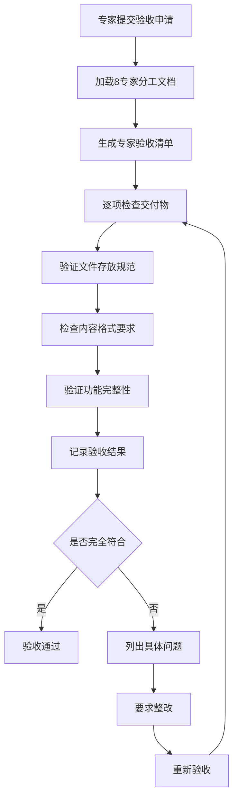

# USTB项目经理验收标准

## 🎯 验收目标
建立详细的验收检查清单，确保每个专家的每个交付物都严格对照《USTB项目8专家分工详细文档.md》检查，实现零缺陷验收，杜绝质量问题流入下一环节。

## 🚨 验收失败根因分析

### 发现的验收问题
1. **检查不彻底**：没有逐项对照8专家分工文档检查
2. **标准不统一**：不同专家使用不同的验收标准
3. **过程不规范**：验收过程缺乏标准化流程
4. **记录不完整**：验收过程和结果记录不完整
5. **问题处理不当**：发现问题后处理流程不规范

### 根本原因
- **缺乏标准化清单**：没有详细的验收检查清单
- **文档对照不严**：没有严格按照8专家分工文档验收
- **质量意识不足**：对验收质量的重要性认识不足
- **流程执行不严**：验收流程执行不够严格

## 📋 标准化验收流程

### 验收流程设计

### 验收前置条件
1. **专家自检完成**：专家必须完成自检并确认符合要求
2. **文档学习完成**：项目经理必须重新学习对应专家的分工文档
3. **验收环境准备**：准备验收所需的工具和环境
4. **时间充分预留**：确保有充分时间进行彻底检查

## 📝 8专家验收检查清单

### 数据处理专家验收清单
基于《USTB项目8专家分工详细文档.md》第42-140行

#### A. 交付物完整性检查
- [ ] **RAG检索数据文件**: `data/processed/rag_data.json`
  - [ ] 文件存在且可访问
  - [ ] 文件大小合理（预期>10MB）
  - [ ] JSON格式有效
  - [ ] 包含全量4621条数据
  - [ ] 包含附件链接字段
  
- [ ] **微调训练数据文件**: `data/processed/training_data.json`
  - [ ] 文件存在且可访问
  - [ ] 包含筛选后的500条数据
  - [ ] 纯文本格式，无附件字段
  - [ ] 平均质量分≥7.5分
  
- [ ] **数据质量报告**: `reports/data_quality_report.md`
  - [ ] 文件存在且格式正确
  - [ ] 包含筛选前后数据对比统计
  - [ ] 包含6维度评分分布分析
  - [ ] 包含质量问题识别和处理记录
  - [ ] 包含重复率分析和去重日志
  
- [ ] **数据处理脚本**: `scripts/data_processing/`
  - [ ] `qwen_scorer.py` - Qwen评分系统
  - [ ] `deduplication.py` - 去重处理脚本
  - [ ] `attachment_extractor.py` - 附件信息提取脚本
  - [ ] `data_splitter.py` - 双数据集分离脚本
  - [ ] `link_validator.py` - 附件链接验证脚本
  - [ ] `data_validator.py` - 数据验证脚本
  - [ ] `config.yaml` - 配置文件
  
- [ ] **API调用日志**: `logs/qwen_api_calls.log`
  - [ ] 包含每次API调用记录
  - [ ] 包含成本统计和额度使用情况
  - [ ] 时间戳完整准确

#### B. 内容质量检查
- [ ] **数据格式验证**
  - [ ] RAG数据包含必需字段：id, title, content, url, category, publish_date, attachments, qwen_score, score_breakdown
  - [ ] 训练数据包含必需字段：id, title, content, category, publish_date, qwen_score
  - [ ] 评分范围在0.5-10.0之间
  - [ ] 6维度评分完整：completeness, relevance, timeliness, usability, accuracy, density
  
- [ ] **数据质量验证**
  - [ ] 无重复数据
  - [ ] 无空值或异常值
  - [ ] 附件链接有效性
  - [ ] 分类标签正确性

#### C. 文件存放规范检查
- [ ] 脚本文件在：`scripts/data_processing/`
- [ ] 处理后数据在：`data/processed/`
- [ ] 报告文件在：`reports/`
- [ ] 日志文件在：`logs/`
- [ ] 无文件乱放现象

#### D. 验收检查点对照
- [ ] Day 2: Qwen API环境配置完成 ✓
- [ ] Day 3: 数据筛选算法开发完成 ✓
- [ ] Day 4: 高质量数据输出完成 ✓

### 数据科学专家验收清单
基于《USTB项目8专家分工详细文档.md》第142-200行

#### A. 交付物完整性检查
- [ ] **独立验证报告**: `reports/data_science_validation.md`
  - [ ] 统计分析结果完整
  - [ ] 数据分布分析详细
  - [ ] 质量评估客观准确
  - [ ] 改进建议具体可行
  
- [ ] **数据分析可视化**: `analysis/data_visualization/`
  - [ ] `score_distribution.png` - 评分分布图
  - [ ] `category_analysis.png` - 分类分析图
  - [ ] `quality_trends.png` - 质量趋势图
  - [ ] `correlation_matrix.png` - 相关性矩阵图
  
- [ ] **质量监控仪表板**: `dashboard/quality_monitor.html`
  - [ ] 实时数据展示
  - [ ] 交互式图表
  - [ ] 质量指标监控
  - [ ] 异常检测功能
  
- [ ] **统计分析脚本**: `scripts/data_analysis/`
  - [ ] `statistical_analysis.py` - 统计分析脚本
  - [ ] `visualization_generator.py` - 可视化生成脚本
  - [ ] `quality_monitor.py` - 质量监控脚本

#### B. 验证质量检查
- [ ] **独立性验证**
  - [ ] 使用不同于数据处理专家的方法
  - [ ] 结果客观公正
  - [ ] 发现的问题真实有效
  
- [ ] **统计准确性**
  - [ ] 统计方法正确
  - [ ] 计算结果准确
  - [ ] 结论逻辑合理

### 问答生成专家验收清单
基于《USTB项目8专家分工详细文档.md》第202-260行

#### A. 交付物完整性检查
- [ ] **问答对数据集**: `data/processed/qa_dataset.json`
  - [ ] 包含约2500个问答对
  - [ ] 覆盖主要教务分类
  - [ ] 问题多样性充分
  - [ ] 答案准确性高
  
- [ ] **生成策略文档**: `docs/technical/qa_generation_strategy.md`
  - [ ] 策略设计合理
  - [ ] 实施步骤清晰
  - [ ] 质量控制措施完善
  
- [ ] **质量评估报告**: `reports/qa_quality_report.md`
  - [ ] 质量指标完整
  - [ ] 评估方法科学
  - [ ] 改进建议具体
  
- [ ] **生成脚本**: `scripts/qa_generation/`
  - [ ] `question_generator.py` - 问题生成脚本
  - [ ] `answer_generator.py` - 答案生成脚本
  - [ ] `quality_evaluator.py` - 质量评估脚本
  - [ ] `dataset_builder.py` - 数据集构建脚本

### RAG系统专家验收清单
基于《USTB项目8专家分工详细文档.md》第262-320行

#### A. 交付物完整性检查
- [ ] **向量数据库**: `data/vectors/qdrant_db/`
  - [ ] 数据库正常启动
  - [ ] 向量索引完整
  - [ ] 检索性能达标
  
- [ ] **RAG API服务**: `src/rag_system/`
  - [ ] API服务正常运行
  - [ ] 接口功能完整
  - [ ] 响应时间合理
  - [ ] 错误处理完善
  
- [ ] **检索性能报告**: `reports/rag_performance_report.md`
  - [ ] 性能指标完整
  - [ ] 测试结果详细
  - [ ] 优化建议具体
  
- [ ] **部署文档**: `docs/deployment/rag_deployment.md`
  - [ ] 部署步骤清晰
  - [ ] 配置说明详细
  - [ ] 故障排除完善

### Web前端专家验收清单
基于《USTB项目8专家分工详细文档.md》第322-380行

#### A. 交付物完整性检查
- [ ] **前端应用**: `src/frontend/`
  - [ ] React应用正常运行
  - [ ] 用户界面美观易用
  - [ ] 功能完整可用
  - [ ] 响应式设计良好
  
- [ ] **用户界面设计**: `docs/design/ui_design.md`
  - [ ] 设计理念清晰
  - [ ] 用户体验良好
  - [ ] 界面规范统一
  
- [ ] **前端测试**: `tests/frontend/`
  - [ ] 单元测试覆盖率≥80%
  - [ ] 集成测试完整
  - [ ] 用户体验测试通过
  
- [ ] **部署配置**: `deployment/frontend/`
  - [ ] 构建配置正确
  - [ ] 部署脚本可用
  - [ ] 环境配置完整

### Web后端专家验收清单
基于《USTB项目8专家分工详细文档.md》第382-440行

#### A. 交付物完整性检查
- [ ] **后端API**: `src/backend/`
  - [ ] FastAPI服务正常运行
  - [ ] API接口功能完整
  - [ ] 数据库连接正常
  - [ ] 安全认证有效
  
- [ ] **API文档**: `docs/api/backend_api.md`
  - [ ] 接口文档完整
  - [ ] 参数说明详细
  - [ ] 示例代码清晰
  
- [ ] **后端测试**: `tests/backend/`
  - [ ] API测试覆盖率≥90%
  - [ ] 性能测试通过
  - [ ] 安全测试通过
  
- [ ] **数据库配置**: `src/backend/database/`
  - [ ] 数据库设计合理
  - [ ] 迁移脚本完整
  - [ ] 备份策略完善

### 模型训练专家验收清单 (AutoDL环境)
基于《USTB项目8专家分工详细文档.md》和《AutoDL环境配置记录.md》

#### A. 环境配置验证
- [ ] **AutoDL环境**: RTX 4090 + Unsloth环境
  - [ ] GPU状态正常 (24GB显存可用)
  - [ ] Unsloth环境激活
  - [ ] 训练数据路径确认: `/root/autodl-tmp/ustb-project/data/training/qa_dataset.json`
  - [ ] 数据分割完成: train/val/test数据集(8:1:1)
  - [ ] HuggingFace镜像配置正常

#### B. 交付物完整性检查
- [ ] **微调模型**: `/root/autodl-tmp/ustb-project/models/trained/`
  - [ ] `deepseek-ustb-tuned/` - LoRA适配器模型
  - [ ] `deepseek-ustb-tuned_merged/` - 合并完整模型
  - [ ] `adapter_model.safetensors` - LoRA适配器权重
  - [ ] `adapter_config.json` - LoRA配置文件
  - [ ] `tokenizer/` - 分词器文件完整

- [ ] **训练脚本**: `/root/autodl-tmp/ustb-project/scripts/training/`
  - [ ] `deepseek_unsloth_training.py` - 主训练脚本
  - [ ] `prepare_dataset.py` - 数据分割脚本
  - [ ] `evaluate_model.py` - 模型评估脚本
  - [ ] `execute_training.py` - 训练执行脚本
  - [ ] `start_training.sh` - 启动脚本
  - [ ] 脚本适配AutoDL环境路径

- [ ] **训练报告**: `/root/autodl-tmp/ustb-project/reports/training_report.md`
  - [ ] 训练过程详细记录 (loss曲线、学习率变化)
  - [ ] RTX 4090 GPU使用情况统计
  - [ ] 训练时间和资源消耗记录
  - [ ] LoRA参数配置记录(r=16, alpha=32, dropout=0)

- [ ] **模型评估**: `/root/autodl-tmp/ustb-project/results/evaluation/`
  - [ ] 验证集评估结果 (BLEU分数、语义相似度)
  - [ ] 测试集评估结果 (最终性能指标)
  - [ ] 推理速度基准测试 (<2秒验证)
  - [ ] USTB教务场景适配测试
  - [ ] 评估报告和详细分析

#### C. 验收检查点 (基于当前进度)
- [x] 2025-08-05: AutoDL环境配置确认完成 ✅
- [x] 2025-08-05: DeepSeek模型测试完全通过 ✅
- [x] 2025-08-05: 推理bug修复完成 ✅
- [x] 2025-08-06: 训练脚本修复完成 ✅
- [/] 2025-08-06: 模型训练执行完成 (进行中)
- [ ] 2025-08-06: 模型评估和验证完成

### 系统集成专家验收清单
基于《USTB项目8专家分工详细文档.md》第502-560行

#### A. 交付物完整性检查
- [ ] **集成系统**: `deployment/integrated_system/`
  - [ ] 系统集成完整
  - [ ] 各模块协调工作
  - [ ] 整体性能达标
  
- [ ] **集成测试**: `tests/integration/`
  - [ ] 端到端测试通过
  - [ ] 性能测试达标
  - [ ] 稳定性测试通过
  
- [ ] **部署文档**: `docs/deployment/system_deployment.md`
  - [ ] 部署流程清晰
  - [ ] 配置说明详细
  - [ ] 监控方案完善
  
- [ ] **运维手册**: `docs/operations/system_operations.md`
  - [ ] 运维流程规范
  - [ ] 故障处理完善
  - [ ] 维护计划详细

## 🔧 验收执行标准

### 验收前准备
1. **重新学习文档**：验收前必须重新学习对应专家的8专家分工文档
2. **准备验收环境**：确保有完整的验收测试环境
3. **预留充足时间**：每个专家验收预留至少2小时
4. **准备验收工具**：自动化检查脚本、测试工具等

### 验收执行要求
1. **严格按清单执行**：必须逐项检查，不得遗漏
2. **详细记录过程**：验收过程和结果必须详细记录
3. **客观公正评价**：基于事实和标准，不带主观色彩
4. **及时反馈问题**：发现问题立即反馈，给出具体整改要求

### 验收结果处理
1. **通过标准**：所有检查项必须100%通过
2. **不通过处理**：列出具体问题清单，要求限期整改
3. **重新验收**：整改完成后重新进行完整验收
4. **记录归档**：验收结果记录归档，作为质量追溯依据

## 📊 验收质量指标

### 过程质量指标
- 验收清单执行完整率：100%
- 问题发现准确率：≥95%
- 验收时间控制：每专家≤3小时
- 验收记录完整率：100%

### 结果质量指标
- 一次验收通过率：≥80%
- 问题整改及时率：100%
- 质量问题流出率：0%
- 专家满意度：≥90%

---

**制定时间**: 2025-08-04  
**制定人**: 梁晓阳项目经理  
**适用范围**: USTB AI教务助手项目全体专家验收  
**执行状态**: 立即生效
